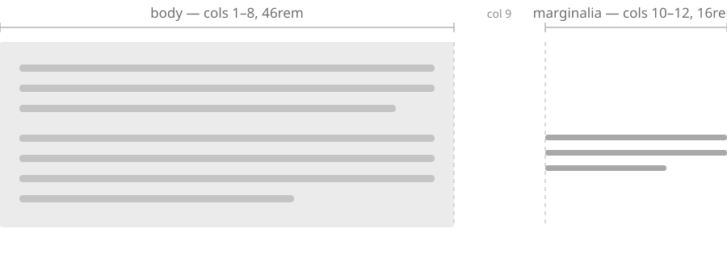

The stylesheets carry two borrowed vocabularies. The Ink & Switch reading layout is a
measure with a gutter beside it, and figures that break out of the measure in named ways —
`wide`, `tile-3`, `float-left`. The seaofclouds arrangements are twelve-column
compositions that place images in deliberate, slightly irregular groupings — `staggered`,
`diagonal`, `organic`.

{{ figure caption-below border 
The reading layout. Nothing flows into the gutter; asides and captions are lifted out of
the flow and positioned into it, level with the paragraph they annotate.
}}

{{ aside Positioned rather than laid out in a column, which is what lets this note sit
beside an arbitrary *line* of the paragraph. Narrow the window and it drops below the
text instead — same markup, different shape around it. }}

They are different design languages, not two themes of one, and they overlap almost
nowhere. Except that both style `<figure>`, and they *disagree* about it: `position:
relative` against `display: flex`, an absolutely-positioned caption in a grey box against
a centred flex row. Loaded together, whichever came last would win for every figure on the
site.

The resolution is worth copying if you ever merge two vocabularies of your own. Bare
`figure` and `figcaption` carry only what both agree on, and every arrangement rule is
scoped to its container. A figure inside `.arrangement` behaves one way; the same figure
in a paragraph behaves the other. Neither vocabulary had to be rewritten, and neither can
reach the other's elements.

## The bug underneath

The nested `{{ aside }}` inside a figure caption that the [styleguide](/docs/styleguide/)
demonstrates didn't work, and the reason turned out to be general. Macro matching used a
lazy `/{{(.+?)}}/`, so an outer macro's match ended at the *inner* macro's closing braces.
Half of one got swallowed and the other half leaked into the page — which was also
happening, silently, to a comment that quoted a macro while explaining it.

Braces are counted now rather than matched by regex, so the outermost macro resolves first
and the inner one expands on the next pass. Nesting works in both directions.

Two smaller things fell out of the same pass. `.move-up` was defined twice with different
values — one with a `-13px` baseline correction, one without — in files loaded in an order
where the correction never applied; it's kept without, because that's the version that has
actually been rendering. And a hardcoded `#f2f2f2` for gutter captions would have been a
bright slab in dark mode, so it's a themed token, and the box only appears when the caption
is genuinely in the gutter. Below an image it's quiet text that doesn't need an edge.
